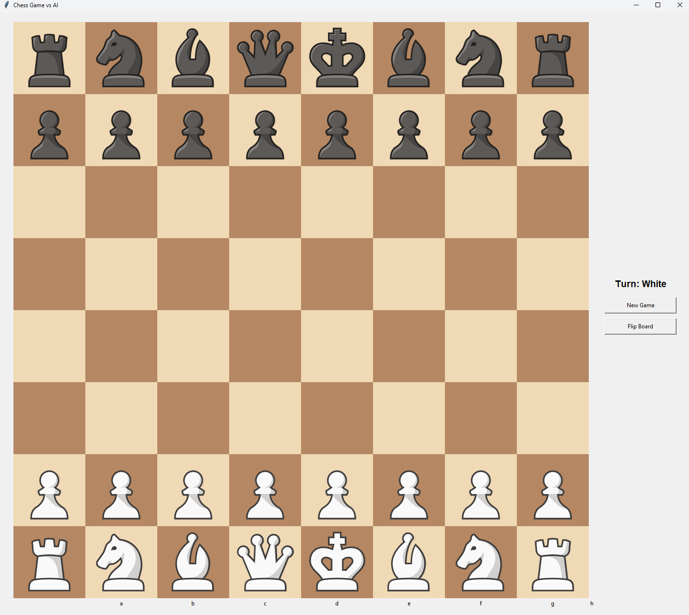

# Chess Engine with Minimax AI

A Python-based chess engine implementation featuring a graphical user interface and AI opponent using the Minimax algorithm with Alpha-Beta pruning.



## Table of Contents
- [Features](#features)
- [Installation](#installation)
- [Project Structure](#project-structure)
- [Usage](#usage)
- [Technical Details](#technical-details)
- [Known Issues](#known-issues)
- [Future Improvements](#future-improvements)

## Features

### Core Functionality
- Complete chess game implementation with standard rules
- GUI built with Tkinter
- Professional chess piece images from chess.com
- AI opponent using Minimax algorithm with Alpha-Beta pruning
- Configurable search depth for AI moves
- Interactive piece movement with click-based interface

### UI Features
- Elegant board design with traditional colors
- Move highlighting system:
  - Selected pieces highlighted in green
  - Valid moves highlighted in blue
  - Last move highlighted in yellow
- Board flipping capability (double-click flip board button)
- Clear turn indicators
- File and rank labels (a-h, 1-8)

### AI Features
- Minimax algorithm with Alpha-Beta pruning
- Configurable search depth (default: 3)
- Material-based position evaluation
- Quick response time with depth=3 setting

## Installation

### Prerequisites
- Python 3.11 or higher
- pip package manager

### Setup Steps
1. Clone the repository:
```bash
git clone https://github.com/adityaanilraut/Chess-engine.git
cd chess
```

2. Install required dependencies:
```bash
pip install pillow

```

3. Verify the project structure:
```
chess-engine/
│
├── chess.ipynb          # Jupyter notebook with development code and GUI implementation
├── chess_engine.py      # Core engine implementation
└── Images/
    ├── white_pawn.png
    ├── white_knight.png
    ├── white_bishop.png
    ├── white_rook.png
    ├── white_queen.png
    ├── white_king.png
    ├── black_pawn.png
    ├── black_knight.png
    ├── black_bishop.png
    ├── black_rook.png
    ├── black_queen.png
    ├── black_king.png
    └── Blank.png
```

## Usage

### Running the Game
1. Navigate to the project directory
2. Run the game:
[](https://www.youtube.com/watch?v=tKpnjuQkn8M)


### Playing the Game
1. You play as White, AI plays as Black
2. Click a piece to select it
   - Valid moves will be highlighted in green
3. Click a highlighted square to make your move
4. The AI will automatically respond after your move
5. Use the "New Game" button to start over
6. Double-click "Flip Board" to rotate the board view

### Configuring AI Depth
- Default depth is 3 (recommended for smooth gameplay)
- To modify search depth, edit `depth` parameter in `get_best_move()` calls:
```python
best_move = engine.get_best_move('black', depth=3)  # Adjust depth here
```
Note: Higher depth values will increase AI strength but significantly increase move calculation time.

## Technical Details

### Implementation Components
1. **Board Representation**
   - 8x8 matrix of piece objects
   - Each piece contains type, color, and movement history

2. **Move Generation**
   - Legal move calculation for each piece type
   - Move validation system
   - Special move handling for castling

3. **AI Implementation**
   - Minimax algorithm with Alpha-Beta pruning
   - Material-based position evaluation
   - Depth-first search strategy

4. **GUI System**
   - Tkinter-based interface
   - Event-driven piece movement
   - Real-time board state updates

## Known Issues

1. **Special Move Limitations**
   - En passant moves not implemented
   - Pawn promotion not available
   - King can be captured (no check/checkmate detection)

2. **Performance Limitations**
   - Single-threaded implementation
   - Search depth limited for practical performance
   - No move time management

## Future Improvements

1. **Functionality Enhancements**
   - Implement en passant
   - Add pawn promotion
   - Add check/checkmate detection
   - Add castling move

2. **Performance Optimizations**
   - Multi-threading support for AI calculations
   - Transposition table implementation
   - Move ordering optimization

3. **UI Improvements**
   - Move history panel
   - Game state saving/loading
   - Multiple AI difficulty levels
   - Piece movement animations

## License
This project is licensed under the MIT License - see the LICENSE file for details.

## Acknowledgments
- Chess piece images sourced from chess.com
- Inspired by traditional chess engines like Stockfish
- Thanks to all contributors and testers
